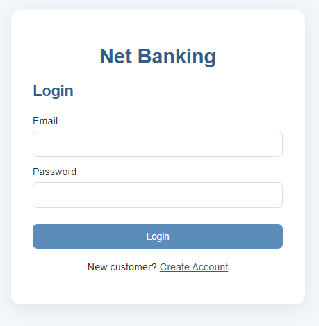
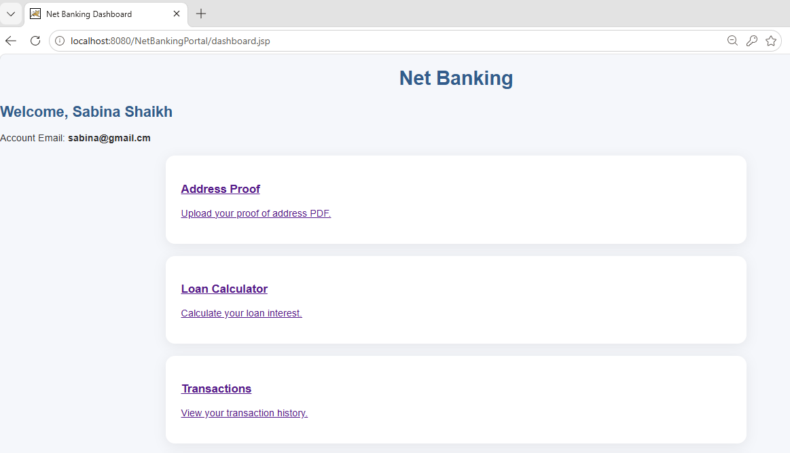
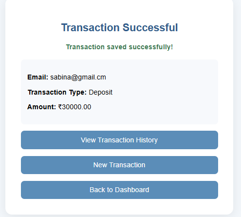

# 🏦 NetBankingPortal

A web-based **Net Banking Portal** developed using **Java EE** technologies. The application provides basic banking functionalities such as user registration, secure login, session management, transaction management, loan interest calculation, and proof-of-address document upload.

---

## 📌 Project Overview

**NetBankingPortal** is a Java EE-based banking application designed to demonstrate the use of different enterprise Java technologies in a single web application.

The project implements:

* User Registration
* User Login and Session Management
* Customer Dashboard
* Transaction Management
* Transaction History
* Loan Interest Calculation
* Proof-of-Address PDF Upload
* Relational Database Storage
* JPA Entity Management
* EJB Business Logic

---

## ✨ Features

### 👤 User Registration

* New customers can create an account.
* Customer details are stored in the MySQL database.
* Email is used as the unique user identifier.

### 🔐 Login & Session Management

* Registered users can log in using their email and password.
* `HttpSession` is used to maintain the logged-in user's session.
* Users can log out securely using the logout functionality.

### 📊 Customer Dashboard

The dashboard provides access to the main banking services:

* Transaction Management
* Loan Calculator
* Address Document Upload
* Transaction History
* Logout

### 💰 Transaction Management

Customers can record banking transactions such as:

* Deposit
* Withdrawal
* Transfer

Transaction details are permanently stored using **JPA** and MySQL.

### 🏠 Proof-of-Address Upload

* Customers can upload their proof-of-address document.
* The application accepts PDF documents.
* Servlet `@MultipartConfig` is used for file upload handling.
* Uploaded documents are stored locally.

### 🏦 Loan Calculator

The loan calculation business logic is implemented using a **Stateless EJB Session Bean**.

The application calculates:

**Interest:**

```text
Interest = (Amount × Rate × Years) / 100
```

**Total Amount:**

```text
Total Amount = Principal Amount + Interest
```

### 🗄️ Database Management

MySQL is used for storing customer and transaction information.

The project demonstrates both:

* JDBC for user registration and document-related database operations
* JPA for transaction persistence

---

## 🛠️ Technologies Used

| Technology      | Purpose                         |
| --------------- | ------------------------------- |
| Java            | Application development         |
| Java EE         | Enterprise web application      |
| Servlets        | Request and response processing |
| HttpSession     | User session management         |
| EJB             | Loan calculation business logic |
| JPA             | Transaction persistence         |
| MySQL           | Relational database             |
| HTML5           | Web page structure              |
| CSS3            | User interface styling          |
| JSP             | Dynamic dashboard page          |
| NetBeans 8.2    | Development IDE                 |
| GlassFish 4.1.1 | Application server              |
| XAMPP           | MySQL server environment        |

---

## 🏗️ Java EE Components Used

The project demonstrates four important Java EE concepts:

### 1. Servlet Session

`HttpSession` is used to maintain the logged-in customer's session between requests.

**Example:**

```java
HttpSession session = request.getSession();
session.setAttribute("email", email);
```

---

### 2. File Upload using `@MultipartConfig`

The address document upload functionality uses:

```java
@MultipartConfig
```

The servlet receives the uploaded PDF and stores it locally.

---

### 3. Enterprise JavaBean

The loan calculation is handled by a Stateless Session Bean:

```java
@Stateless
public class LoanCalculatorBean
```

The bean contains the business logic for calculating loan interest and total payable amount.

---

### 4. JPA Entity

Transaction information is represented using a JPA Entity:

```java
@Entity
public class Transaction
```

JPA is used to persist transaction records into the MySQL database.

---

## 📁 Project Structure

```text
NetBankingPortal/
│
├── nbproject/
│   ├── build-impl.xml
│   ├── project.properties
│   └── project.xml
│
├── src/
│   ├── conf/
│   │   ├── MANIFEST.MF
│   │   └── persistence.xml
│   │
│   └── java/
│       └── com/
│           └── netbanking/
│               │
│               ├── ejb/
│               │   └── LoanCalculatorBean.java
│               │
│               ├── entity/
│               │   └── Transaction.java
│               │
│               └── servlet/
│                   ├── LoginServlet.java
│                   ├── LogoutServlet.java
│                   ├── RegisterServlet.java
│                   ├── LoanServlet.java
│                   ├── TransactionServlet.java
│                   └── UploadServlet.java
│
├── web/
│   ├── index.html
│   ├── login.html
│   ├── register.html
│   ├── dashboard.jsp
│   ├── loan.html
│   ├── upload-address.html
│   └── style.css
│
├── build.xml
├── .gitignore
└── README.md
```

---

## 🗄️ Database Setup

Create a MySQL database named:

```sql
CREATE DATABASE netbanking;
```

Select the database:

```sql
USE netbanking;
```

### Users Table

```sql
CREATE TABLE users (
    id INT PRIMARY KEY AUTO_INCREMENT,
    name VARCHAR(100) NOT NULL,
    email VARCHAR(100) UNIQUE NOT NULL,
    password VARCHAR(100) NOT NULL
);
```

### Transactions Table

```sql
CREATE TABLE transactions (
    id INT PRIMARY KEY AUTO_INCREMENT,
    email VARCHAR(100),
    type VARCHAR(50),
    amount DOUBLE,
    transaction_date TIMESTAMP DEFAULT CURRENT_TIMESTAMP
);
```

### Documents Table

```sql
CREATE TABLE documents (
    id INT PRIMARY KEY AUTO_INCREMENT,
    email VARCHAR(100),
    filename VARCHAR(255),
    filepath VARCHAR(500),
    upload_date TIMESTAMP DEFAULT CURRENT_TIMESTAMP
);
```

---

## 🔌 Database Configuration

The application uses MySQL with the following connection details in the Servlet code:

```java
Class.forName("com.mysql.jdbc.Driver");

String url = "jdbc:mysql://localhost:3306/netbanking";
String username = "root";
String dbPassword = "";

Connection con =
    DriverManager.getConnection(url, username, dbPassword);
```

> **Note:** For production applications, database credentials should not be hard-coded in source code. This project uses this approach for educational/demo purposes.

---

## ▶️ How to Run the Project

### Prerequisites

Install and configure:

1. Java JDK
2. NetBeans 8.2
3. GlassFish Server 4.1.1
4. XAMPP
5. MySQL
6. MySQL Connector/J

---

### Step 1 — Start MySQL

Open **XAMPP Control Panel** and start:

```text
MySQL
```

---

### Step 2 — Create the Database

Open phpMyAdmin or MySQL and execute the database SQL commands provided above.

---

### Step 3 — Open the Project

Open NetBeans 8.2.

Select:

```text
File → Open Project
```

Open:

```text
NetBankingPortal
```

---

### Step 4 — Configure GlassFish

Make sure **GlassFish Server 4.1.1** is configured in NetBeans.

Set GlassFish as the project's server.

---

### Step 5 — Add MySQL Connector

Make sure the MySQL JDBC driver is available to the project.

The project uses:

```text
mysql-connector-java-5.1.23
```

---

### Step 6 — Run the Project

Right-click the project in NetBeans and select:

```text
Run
```

The application opens in the browser.

---

## 🔄 Application Flow

```text
             ┌──────────────────┐
             │   Home Page       │
             │    index.html     │
             └────────┬─────────┘
                      │
              ┌───────┴────────┐
              │                │
              ▼                ▼
       ┌─────────────┐  ┌──────────────┐
       │    Login    │  │ Registration │
       │  login.html │  │ register.html│
       └──────┬──────┘  └───────┬──────┘
              │                  │
              ▼                  ▼
       ┌─────────────────────────────┐
       │         Servlets            │
       │ LoginServlet / Register     │
       └──────────────┬──────────────┘
                      │
                      ▼
             ┌─────────────────┐
             │ Customer        │
             │ Dashboard       │
             └────────┬────────┘
                      │
        ┌─────────────┼──────────────┐
        │             │              │
        ▼             ▼              ▼
   Transactions    Loan          Document
   Management    Calculator       Upload
        │             │              │
        ▼             ▼              ▼
       JPA           EJB          Multipart
        │             │              │
        └─────────────┼──────────────┘
                      ▼
                 MySQL Database
```

---

## 🔒 Security Considerations

This project is created for educational purposes.

A production banking application would additionally require:

* Password hashing
* HTTPS
* Secure session configuration
* Input validation
* CSRF protection
* Access control
* Secure file storage
* Database credential protection
* Audit logging
* Additional authentication mechanisms

---

## 🎓 Academic Purpose

This project demonstrates the practical implementation of Java EE technologies including:

* Servlets
* Session Management
* File Upload
* EJB
* JPA
* JSP
* JDBC
* MySQL

It can be used as an academic project for understanding how different Java EE components work together in a web-based banking application.

---

## 👩‍💻 Author

**Shaikh Juveriya**

BSc Information Technology

---

## 📄 License

This project is created for educational and academic purposes.

## 📸 Project Screenshots

### 🏠 Home Page


### 📝 Registration


### 🔐 Login




### 📊 Dashboard



### 📄 Proof-of-Address Upload


### 🏦 Loan Calculator


### 💳 Transactions



### 🗄️ Database


